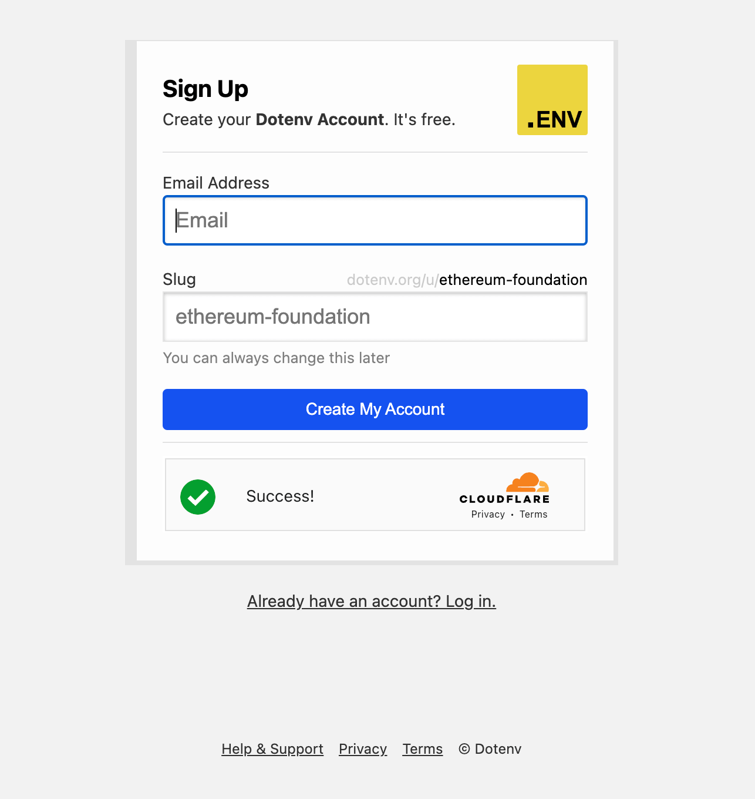

# cloudflare_turnstile

Add [Cloudflare Turnstile](https://blog.cloudflare.com/turnstile-private-captcha-alternative/) to your Rails app in seconds.

[](https://rubygems.org/gems/cloudflare_turnstile)

## Installation

Add this line to your Gemfile and then execute bundle install:

```ruby
gem "cloudflare_turnstile"
```

## Usage

Set the following variables in your environment, .env file, or an initializer.

```
CLOUDFLARE_TURNSTILE_SITE_KEY=""
CLOUDFLARE_TURNSTILE_SECRET_KEY=""
```

Add the view helper to your form - just before the submit button is usually a good spot.

```erb
<%= form_for(@user) do |f| %>
  ..
  <%= cloudflare_turnstile %>
  <%= f.submit "Log In" %>
<% end %>
```

Then enable it for the controller actions you wish. It works just like a `before_action`. Pass `only:` with the action names.

```ruby
class LoginController < ApplicationController
  cloudflare_turnstile only: [:login_submit]

  def login
  end

  def login_submit
    # Turnstile verification will take place here - prior to code. If it catches a spam bot it will halt it.

    ..
  end
end
```

When catching a spam bot, it defaults to sending no content with a 200 status code. This way the spam bot will assume it was successful - tricking it.

## Example



## Credits

Inspiration [invisible_captcha](https://github.com/markets/invisible_captcha)
